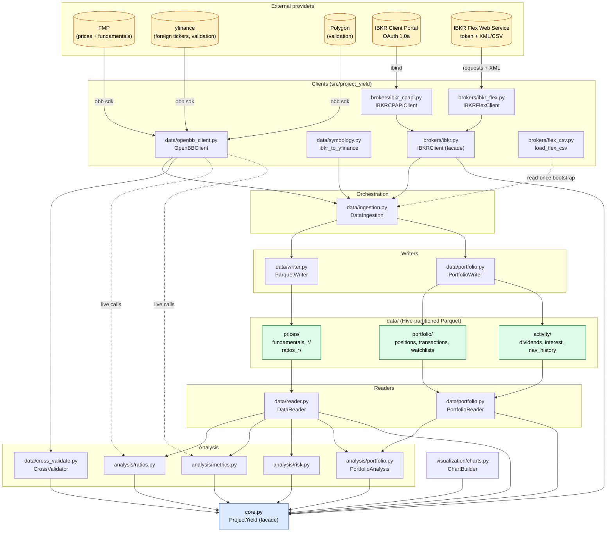
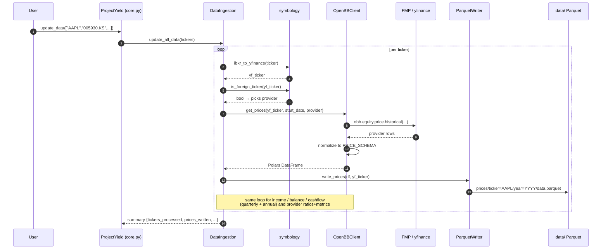
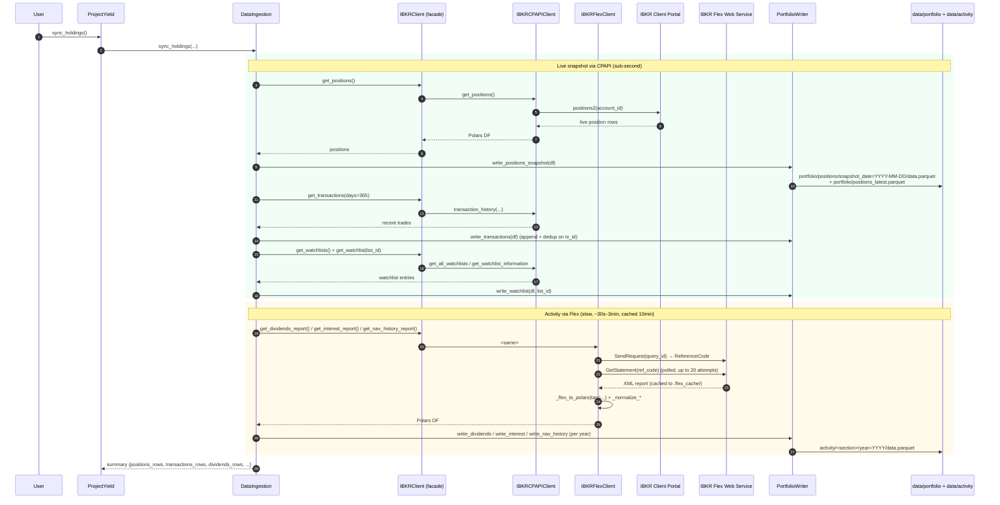
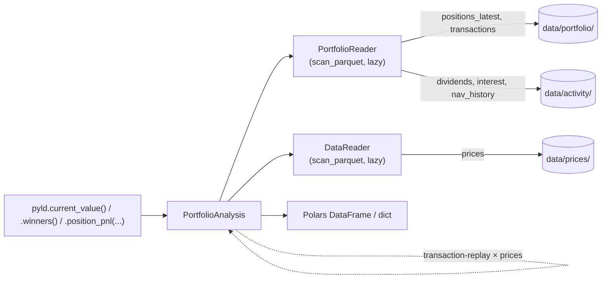

# Project Yield — Architecture

**Last updated:** 2026-05-17

This document describes how data flows from external providers (OpenBB
fundamentals/prices, IBKR portfolio + activity) into local Parquet storage,
and back out through analysis and the facade. Diagrams are Mermaid so they
render in GitHub and in most IDEs.

Update this file whenever a component or data path changes.

---

## 1. Component graph



**Key invariants:**

- `OpenBBClient` is the **only** code path that talks to FMP / yfinance / Polygon. Provider routing and schema normalization live here ([data/openbb_client.py](../src/project_yield/data/openbb_client.py)).
- `IBKRClient` (the facade in [brokers/ibkr.py](../src/project_yield/brokers/ibkr.py)) is the only entry into IBKR. It composes a CPAPI sub-client (live, sub-second, OAuth 1.0a) and a Flex sub-client (historical/income, token, slow). Both are lazy — missing creds on one path do not break the other.
- All Parquet writes go through `ParquetWriter` (research data) or `PortfolioWriter` (broker data). All reads go through `DataReader` / `PortfolioReader`. Analysis modules never touch the filesystem directly.
- `ProjectYield` in [core.py](../src/project_yield/core.py) is the only public-facing surface. Everything else is composable internals.

---

## 2. Storage layout (Hive-partitioned Parquet under `data/`)

```
data/
├── prices/                          ParquetWriter, partitioned ticker × year
│   └── ticker=AAPL/year=2024/data.parquet
├── fundamentals_quarterly/          ParquetWriter, partitioned ticker
│   └── ticker=AAPL/data.parquet
├── fundamentals_annual/             ParquetWriter, partitioned ticker
│   └── ticker=AAPL/data.parquet
├── ratios_quarterly/                ParquetWriter (FMP-published, cross-val)
├── ratios_annual/                   ParquetWriter (FMP-published, cross-val)
├── metadata/                        ParquetWriter (companies, updates)
├── portfolio/                       PortfolioWriter (IBKR-sourced)
│   ├── positions/snapshot_date=YYYY-MM-DD/data.parquet   one row per held instrument per day
│   ├── positions_latest.parquet                          convenience: most recent snapshot
│   ├── transactions.parquet                              append + dedup on tx_id
│   └── watchlists/list_id=<name>/data.parquet            one file per IBKR watchlist
└── activity/                        PortfolioWriter (Flex output, year-partitioned)
    ├── dividends/year=YYYY/data.parquet
    ├── interest/year=YYYY/data.parquet
    └── nav_history/year=YYYY/data.parquet                 daily NAV time series
```

The Flex response cache lives **outside** `data/` at `.flex_cache/flex_<query_id>.xml` so a `rm -rf data/` for iteration doesn't burn through IBKR's per-query rate limit.

---

## 3. Data flow: OpenBB research ingestion

Triggered by `pyld.update_data(tickers)` (or `pyld.update_held()` after a portfolio sync).



Notes:
- **Symbology runs at the boundary only.** IBKR-native symbols like `005930` get translated to yfinance form (`005930.KS`) once in `DataIngestion._ingest_one`; everything downstream — API calls, partition keys, the `ticker` column in Parquet — uses the yfinance form.
- **Provider routing is per-ticker.** Foreign tickers route to yfinance because FMP is US-only. The provider switch lives in `_ingest_one`, not in `OpenBBClient`.
- **Schemas are enforced.** `OpenBBClient` collapses provider-specific column names into canonical schemas declared in [data/schemas.py](../src/project_yield/data/schemas.py). Required-column assertions fail loudly if a provider silently changes its response.

---

## 4. Data flow: IBKR portfolio sync

Triggered by `pyld.sync_holdings()` (fast path + Flex) or `pyld.sync_via_flex()` (Flex-only bootstrap). The facade routes to either the CPAPI or Flex sub-client per the source-of-truth table below.



The `sync_via_flex(consolidated=True)` variant skips the CPAPI block entirely and calls `flex.get_consolidated_report()` — one Flex query returns positions + trades + dividends + interest + NAV in a single round-trip (one rate-limit hit instead of four). `sync_via_flex_csv(path)` skips the network entirely and parses a manually-downloaded CSV via [brokers/flex_csv.py](../src/project_yield/brokers/flex_csv.py).

### Source-of-truth table

| Data | Primary | Reason |
|---|---|---|
| Live positions, MV, unrealized PnL | CPAPI `get_positions()` | live, sub-second; Flex `OpenPosition` is point-in-time fallback only |
| Account summary / cash / NetLiq | CPAPI `get_account_summary()` / `get_ledger()` | no Flex equivalent |
| Watchlists | CPAPI `get_watchlists()` / `get_watchlist()` | Flex doesn't expose them |
| Transactions — full history backfill | Flex `get_trades_report()` | CPAPI capped ~90 days, per-conid |
| Transactions — daily incremental | CPAPI `get_transactions(days=N)` | sub-second; dedup on `tx_id` against the Flex backfill |
| Dividends (per event, withholding, payDate) | Flex `get_dividends_report()` | only Flex has per-event detail |
| Interest / bond coupons | Flex `get_interest_report()` | only Flex has per-source detail |
| Daily NAV history | Flex `get_nav_history_report()` | row-per-trading-day, single call |
| YTD / MTD return % | CPAPI `get_performance()` | fast; Flex NAV is the audit path |

---

## 5. Data flow: portfolio analysis (read path)

Triggered by `pyld.current_value()`, `pyld.portfolio_value_history()`, `pyld.winners()`, etc. All reads are lazy Polars `scan_parquet` queries with partition-pruning.



The core trick in `PortfolioAnalysis`: for any date in the transaction history, derive position quantity as the cumulative sum of buys minus sells up to that date, then multiply by the close price from local `data/prices/` Parquet to get market value. This is why **transactions live in Flex's full-history dataset, but prices live in the OpenBB-ingested Parquet** — the two datasets join on `(ticker, date)` to reconstruct portfolio value over time without ever calling Flex per-day.

---

## 6. Component reference

| Module | Responsibility | Notes |
|---|---|---|
| [core.py](../src/project_yield/core.py) `ProjectYield` | Public facade. Composes everything. | Only thing users import directly. |
| [config.py](../src/project_yield/config.py) `Settings` | Pydantic settings, layered: env → `.env` → `config.yaml` → defaults. | All paths derived here. |
| [data/openbb_client.py](../src/project_yield/data/openbb_client.py) `OpenBBClient` | Provider routing (FMP / yfinance / Polygon) + schema normalization. | Only file that imports `openbb`. |
| [data/symbology.py](../src/project_yield/data/symbology.py) | IBKR → yfinance ticker translation; foreign-ticker detection. | Boundary translation only. |
| [data/schemas.py](../src/project_yield/data/schemas.py) | Canonical column schemas + provider source maps. | Add a new provider by extending `Field.sources`. |
| [data/writer.py](../src/project_yield/data/writer.py) `ParquetWriter` | Writes research data (prices, fundamentals, ratios, metadata). | Hive partitioning. |
| [data/reader.py](../src/project_yield/data/reader.py) `DataReader` | Lazy reads from research Parquet. | `_scan_ticker` returns None on empty → callers short-circuit. |
| [data/portfolio.py](../src/project_yield/data/portfolio.py) `PortfolioWriter` / `PortfolioReader` | Writes/reads IBKR-sourced portfolio + activity data. | Daily-snapshot partitioning for positions; tx_id dedup for transactions. |
| [data/ingestion.py](../src/project_yield/data/ingestion.py) `DataIngestion` | Orchestrates OpenBB ingestion + IBKR sync. | `update_held()` bridges the two: IBKR positions drive what OpenBB ingests. |
| [data/cross_validate.py](../src/project_yield/data/cross_validate.py) `CrossValidator` | FMP vs Polygon / yfinance comparison. | Uses validation providers from Settings. |
| [brokers/ibkr.py](../src/project_yield/brokers/ibkr.py) `IBKRClient` | Coordinator facade: routes to CPAPI or Flex per data type. | Methods preserved for ingestion.py compatibility. |
| [brokers/ibkr_cpapi.py](../src/project_yield/brokers/ibkr_cpapi.py) `IBKRCPAPIClient` | Wraps `ibind.IbkrClient` (OAuth 1.0a). | Lazy: OAuth init on first call. |
| [brokers/ibkr_flex.py](../src/project_yield/brokers/ibkr_flex.py) `IBKRFlexClient` | Flex Web Service: two-call REST + XML/CSV parse + 10-min cache. | Independent of OAuth. |
| [brokers/flex_csv.py](../src/project_yield/brokers/flex_csv.py) `load_flex_csv` | Parse a manually-downloaded Flex CSV (no API call). | Bootstrap when rate-limited. |
| [analysis/ratios.py](../src/project_yield/analysis/ratios.py) `RatioCalculator` | PE, PEG, margins, growth. Live OpenBB calls for current price + forward EPS. | |
| [analysis/metrics.py](../src/project_yield/analysis/metrics.py) `MetricsEngine` | Screening, comparison, ranking, sector roll-ups. | |
| [analysis/risk.py](../src/project_yield/analysis/risk.py) `RiskMetrics` | Sharpe / Sortino via `openbb-quantitative` against local prices. | |
| [analysis/portfolio.py](../src/project_yield/analysis/portfolio.py) `PortfolioAnalysis` | Transaction-replay + NAV-history portfolio performance. | Joins `data/portfolio/` against `data/prices/`. |
| [visualization/charts.py](../src/project_yield/visualization/charts.py) `ChartBuilder` | Plotly charts off Parquet. | |

---

## 7. Design principles

1. **Single source per dataset.** Every Parquet partition has exactly one writer. `ParquetWriter` owns research; `PortfolioWriter` owns broker data. Analysis modules never write.
2. **Thin clients, fat orchestrators.** `OpenBBClient` and `IBKRCPAPIClient`/`IBKRFlexClient` are mostly one-line delegations to the underlying SDK plus normalization. The composition decisions (which provider, when to refresh, dedup rules) live in `DataIngestion`.
3. **Lazy everywhere.** All readers use `pl.scan_parquet`. Both IBKR sub-clients build on first call. `CrossValidator` is `@property`-lazy on the facade. This keeps cold-start cheap and keeps a broken auth on one path from cascading.
4. **Symbology at the boundary.** Convert IBKR-native symbols to yfinance form once in `DataIngestion`; downstream code never has to think about it.
5. **No silent fallback between sources.** If CPAPI is down, `get_positions()` raises — it doesn't auto-fall-back to Flex. The two sources answer subtly different questions; mixing them silently would hide both auth rot and semantic drift.
6. **Caches live outside `data/`.** Anything that costs real money or rate limit (Flex XML responses) is cached at `.flex_cache/` so a `rm -rf data/` during iteration doesn't reset it.

---

## 8. Open follow-ups

These are known soft spots in the current architecture, worth tracking here so the diagram and the code stay aligned as they're addressed:

- **`.flex_cache/` path is hardcoded relative to CWD** in [brokers/ibkr_flex.py](../src/project_yield/brokers/ibkr_flex.py). Should be a Settings-controlled path.
- **No tests under `tests/`** for the broker layer. The smoke script in conversation is the only verification today.
- **OAuth 2.0 Web API migration.** IBKR's stated direction is OAuth 2.0; CPAPI sub-client would be the swap point if/when retail access opens up.
